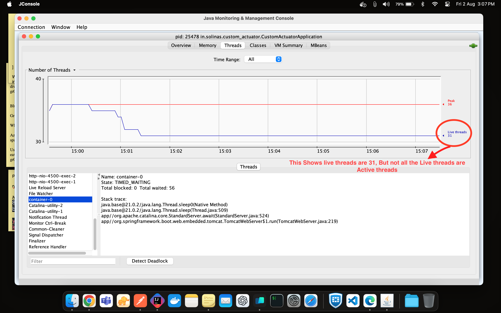
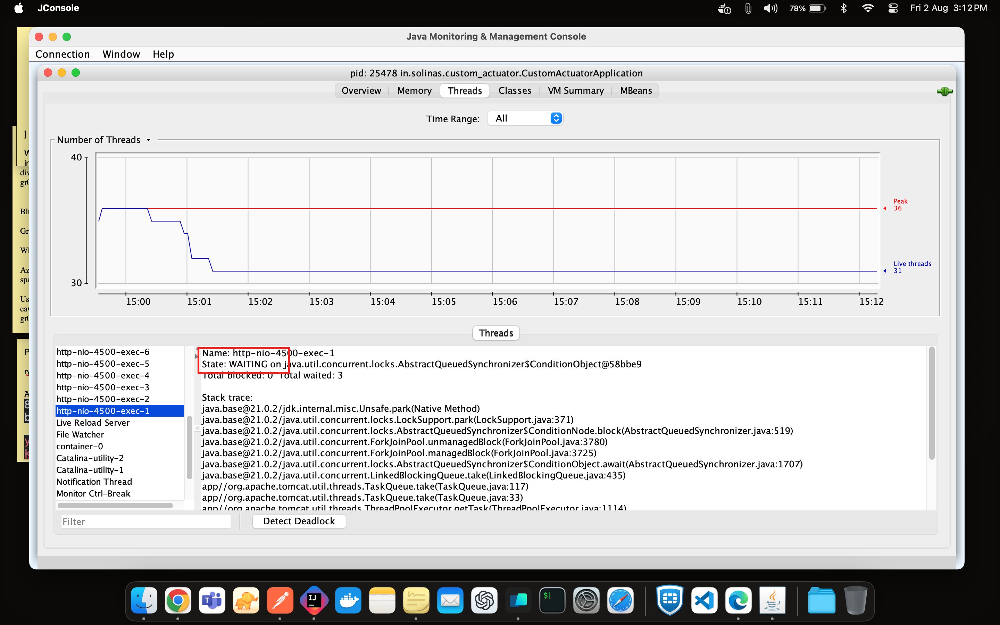
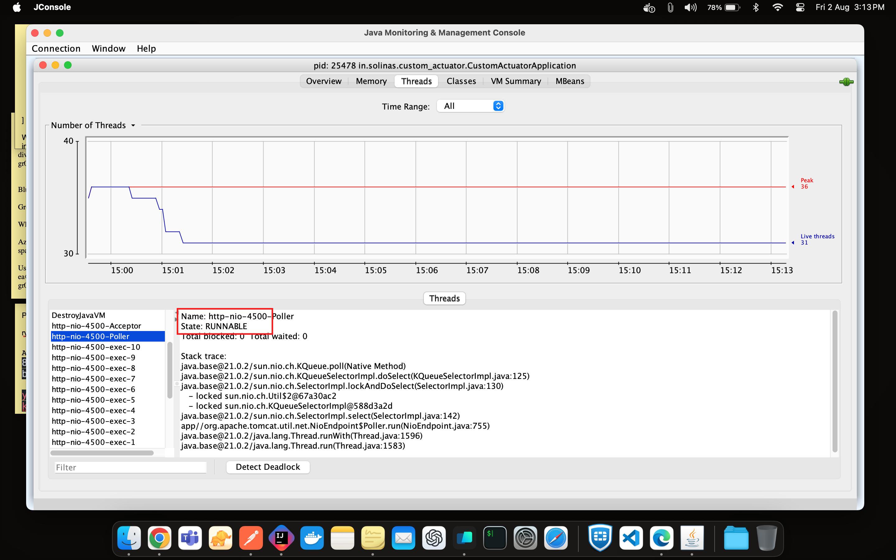

# Solinas Custom Actuator Spring Boot Application

This Spring Boot project demonstrates the implementation of a custom actuator endpoint that retrieve the current number of active threads in the JVM.

## Prerequisite and Note

 - Please make sure you have the Java 17 ony your system to run locally. If not, use the Docker approach to run the application
 - This application runs on port 4500 (lucky number basically)

## To run the project Locally

```yaml
./mvnw spring-boot:run
```

## Running the Project with Docker

1. Build the Docker image:

```yaml
docker build -t solinas-custom-actuator .
```

2. Run the Docker container:

```yaml
docker run -p 4500:4500 solinas-custom-actuator
```

## Accessing the Custom Actuator Endpoint

1. The JVM active thread count can be viewed using the following curl command directly. 
Paste this in the terminal:

```curl
curl -X 'GET' \
  'http://localhost:4500/actuator/solinas-jvm-thread-active' \
  -H 'accept: application/json'
```

2. For neat API documentation, navigate to "http://localhost:4500". This will take you directly to the Swagger UI. I've presented this with Swagger documentation as browsers don't render JSON properly

3. Generically If you prefer, you can access "http://localhost:4500/actuator/solinas-jvm-active-thread" directly in the browser, but I recommend using Swagger.

## My views on this task:

While developing the custom actuator to retrieve active threads, I wanted to ensure that we're not confusing live threads with active threads. To clarify the difference between active threads and live threads, I've used `jconsole` to justify the thread data.

Here's what I found:



As seen above examine screenshot of this application, the live thread count is 31, but these live threads may not all be in an active state. Some live threads may not have died, but they may not be in a RUNNING state

To ensure this:

Look at the screenshot below of the live threads' states. It shows threads in the `WAITING` state. These threads are waiting to execute but are not active at present. Eg: This thread may in sleep and waiting for its turn to execute, but not died, but not actively running thread either... 



The Active threads are has a state with `RUNNABLE`



`So this the reason i've a made a code to filter the exact RUNNABLE state threads alone, to align with the task requirement of active threads.`

In the output of the actuator endpoint the key `activeThreadCount` holds the value of current JVM active threads, combining the `activeThreadNames` with the active threads names additionally

---

> Thanks `Solinas` for the opportunity to present this task... Looking ahead 

Best regards,
Divakaran